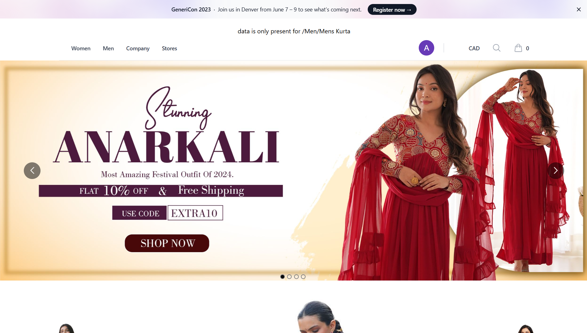
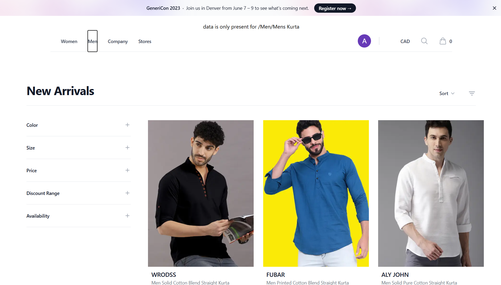
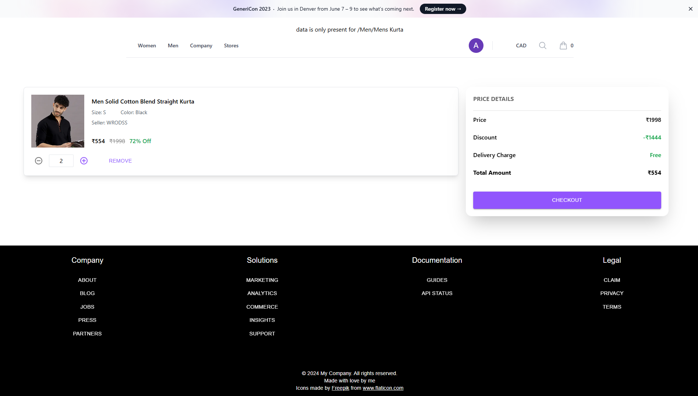
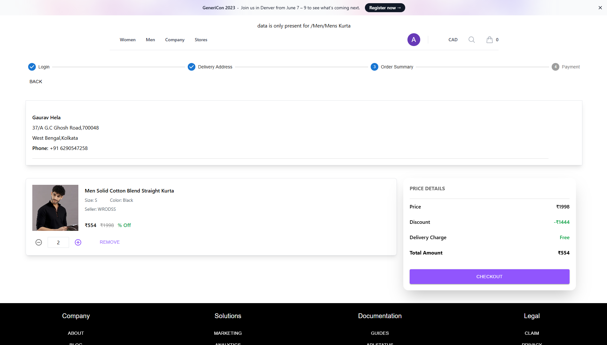
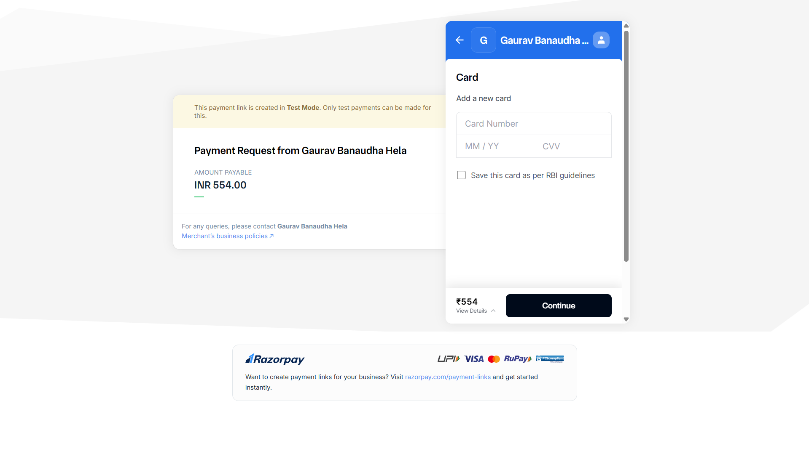

# 🛍️ E-Commerce MERN Stack App

A full-stack e-commerce application built with the **MERN** stack:

- **MongoDB**, **Express**, **React**, and **Node.js**
- JWT Authentication, Razorpay integration, Redux for state management

On this website, we have an authentication system for both admin and user roles. For the user interface, we use Material UI, and Razorpay is integrated as the payment gateway.

A user can register or log in to the website, after which they can explore all the available products. If they like a product, they can add it to the cart, adjust the quantity, and add multiple products simultaneously. During checkout, the user needs to provide their address and contact number, after which the order summary page will be displayed. The payment page will then open, where the user can select their preferred payment method and complete the transaction by entering the OTP. Upon successful payment, the order will be placed successfully.

In the admin panel, the admin can view the progress and details of all orders. The admin can also add or remove any products that have been published.

---

## 📦 Features

### 🔒 Authentication

- User registration & login with JWT
- Password hashing with bcrypt
- Protected routes using token-based auth

### 🛒 Shopping

- Product categories and details
- Add to cart, checkout
- Place and view orders
- Rating and reviews

### 💳 Payment

- Razorpay integration
- Secure payment processing
- Payment success page with order confirmation

---

## 🧩 Tech Stack

| Frontend            | Backend            |
| ------------------- | ------------------ |
| React.js            | Node.js            |
| Redux Toolkit       | Express.js         |
| React Router        | MongoDB (Mongoose) |
| Material UI         | JWT Auth           |
| Toast Notifications | Razorpay SDK       |
| Axios API calls     | RESTful APIs       |

---

## ⚙️ Installation & Setup

### ✅ Prerequisites

- Node.js (v16+ recommended)
- MongoDB Atlas or local instance
- Razorpay account (for test key)

---

---

## 🔐 Environment Variables

Create a `.env` file in the **backend** root with:

```env
PORT=3000
MONGODB_URI=your_mongodb_connection_string
JWT_SECRET_KEY=your_jwt_secret
JWT_EXPIRES=7d
RAZORPAY_KEY_ID=your_razorpay_key_id
RAZORPAY_KEY_SECRET=your_razorpay_key_secret
```

In the frontend (`src/config/apiConfig.js`):

```env
export const API_BASE_URL = "http://localhost:3000/api";
```

---

## 🚀 Running the Project

📌 Backend

```
cd backend
npm install
npm run dev
```

Make sure MongoDB and Razorpay keys are configured properly.

📌 Frontend

```
cd frontend
npm install
npm run dev
```

Runs at: http://localhost:5173/ (or based on your Vite config)

---

## 🧪 Testing (Optional)

You can test payment flows using Razorpay's test keys:

Use card number: `4111 1111 1111 1111`

Any future date & CVV

---

## 🖼️ Screenshots

| Home Page                   | Product Details                            | Cart                        |
| --------------------------- | ------------------------------------------ | --------------------------- |
|  |  |  |

| Checkout                            | Payment Success                   |
| ----------------------------------- | --------------------------------- |
|  |  |

---

## 🤝 Contribution

Pull requests welcome! Just make sure to:

- Format code with Prettier/ESLint

- Use proper commit messages

- Update documentation if needed

---

## 📝 License

MIT License — Feel free to use and modify

---

## 🙏 Credits

Developed with ❤️ by Gaurav
